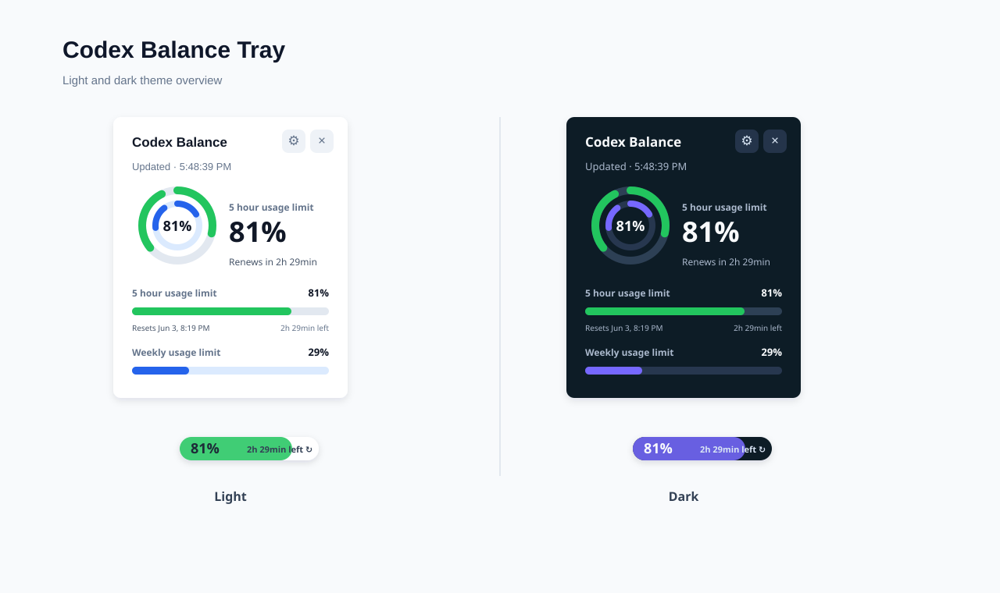
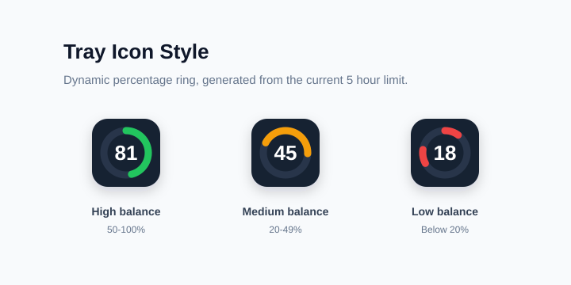
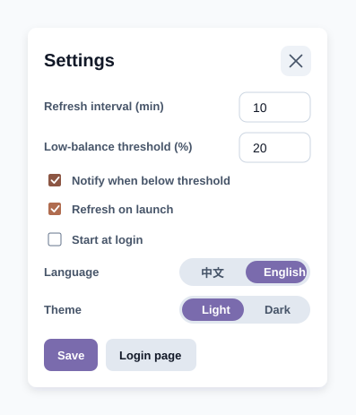
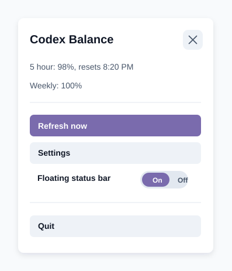

# Codex QuotaRing

[中文说明](README.zh-CN.md) | English

A Windows tray app for monitoring ChatGPT Codex balance and usage limits.

Codex QuotaRing shows the 5 hour usage limit and weekly usage limit in a compact tray panel, a tray icon, and an optional floating status bar.

## Preview



## Features

- Main panel: shows 5 hour balance, weekly balance, next renewal time, and the latest read time
- Windows tray icon: shows the 5 hour usage limit percentage



- Floating status bar: keeps the 5 hour balance visible on the desktop
- Light/dark themes and Chinese/English UI



- Manual refresh and configurable automatic refresh interval
- Low-balance notification settings
- Start at login option
- Custom right-click tray menu



## Usage Advice Rules

The main panel shows a short usage suggestion based on the 5 hour limit and weekly limit.

| Condition | Display text |
| --- | --- |
| Weekly limit < 20% | Quota is tight |
| 5 hour limit < 15% | Quota is tight |
| 15% <= 5 hour limit < 30% | Quota is low |
| Weekly limit < 40% and 5 hour limit >= 30% | Use for critical tasks |
| 30% <= 5 hour limit < 60% and weekly limit >= 40% | Keep using |
| 5 hour limit >= 60% and weekly limit >= 40% | Ready for long tasks |

## Important Notice

This is an unofficial tool and is not affiliated with OpenAI.

OpenAI does not currently provide a public API for this Codex usage page. This app reads the text content from the ChatGPT Codex usage page:

```text
https://chatgpt.com/codex/cloud/settings/analytics#usage
```

If the page structure changes, balance reading may fail until the parsing logic is updated.

## Privacy

The app uses an Electron browser session so you can log in to ChatGPT locally. Login cookies, cache, preferences, and app settings are stored locally in the app user data directory.

Do not commit or share the `userdata/` directory. It may contain browser cache or login-related data.

## Development

Install dependencies:

```bash
npm install
```

Run in development:

```bash
npm start
```

## Build Windows Installer

Install dependencies first:

```bash
npm install
```

Build an installer:

```bash
npm run dist
```

The installer will be generated in:

```text
dist/
```

## Icon Attribution

This project includes icons from Fluent UI System Icons by Microsoft, licensed under the MIT License. See `NOTICE`.
